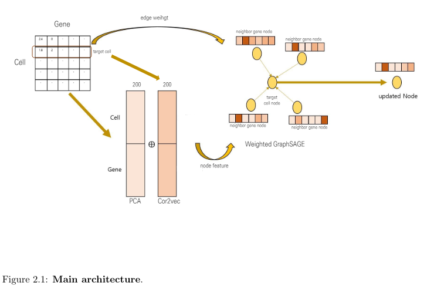
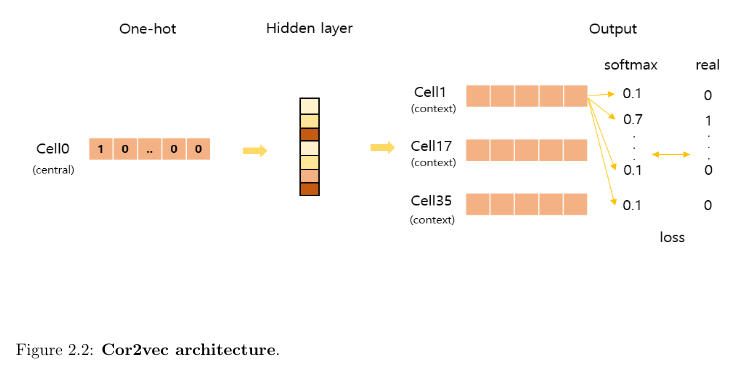
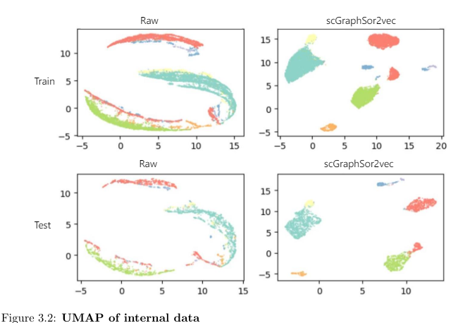
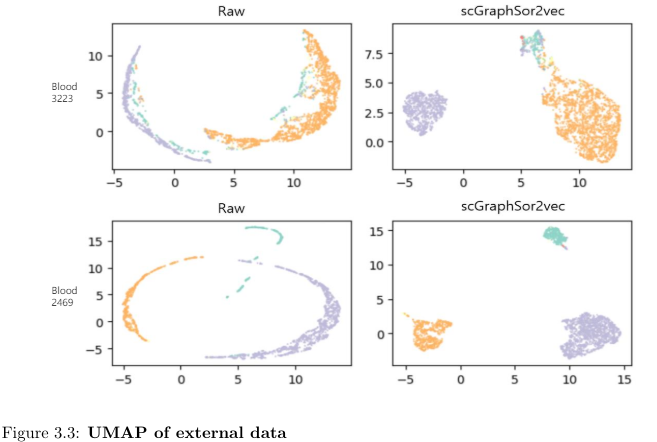

# scGraphSor2vec

This study aims to accurately understand the characteristics of single-cell data  
and develop a model that functions even with **unseen external data**.  

We introduce single-cell graph samples and aggregation with cor2vec (scGraphSor2vec). scGraphSor2vec is structured into four key stages:  
embedding, cor2vec, weighted graph sample and aggregation (GraphSAGE), and a linear classifier.  

* Four key steps  
  Embedding : PCA (each cell and gene)  
  Cor2vec : Cor2vec specifically adopted the skip-gram approach of Word2vec. 
  We aimed to select cells and genes with a PCC (Pearson Correlation Coefficient) above a certain level to provide weighted information. 
  GraphSAGE : Cells and genes were configured as nodes, with correlations as edges. 
  Linear classifier : Classification of cell types based on the characteristics of single-cell data. 

We developed scGraphSor2vec, a method that combined supervised deep learning with weighted GraphSAGE and cor2vec approaches,  
for **classifying cell types** in human and mouse single-cell RNA-seq data. 

We can classify 

## Data
* Single-cell data  
Human : 10 tissues with internal and external data  
Mouse : 12 tissues with internal and external data  

## Main Architecture
 

## UMAP
 
